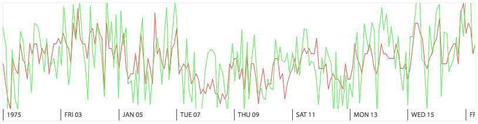

# react-layered-chart

A high-performance canvas-based time series visualization in Typescript + React.



[](https://circleci.com/gh/palantir/react-layered-chart)
[](https://www.npmjs.com/package/react-layered-chart)

## Installation

```
npm install --save react-layered-chart
```

Be sure to include the styles from `react-layered-chart/react-layered-chart.css`. This file is also specified on the `style` key in `package.json` for any toolchains that support it.

### `process.env.NODE_ENV`

Your build should specify a value for `process.env.NODE_ENV`, or at least shim it out so it doesn't fail at runtime. If you would like to get verbose debugging for what's going on inside a `ChartProvider`, specify a value of `"development"` for `process.env.NODE_ENV`.

### Typings

If you're using Typescript, you must provide typings for a global `Promise`, as this type appears in the API of react-layered-chart. If you're targeting ES6, the standard library typings should suffice. Otherwise, you can install something like [`es6-promise`](https://github.com/DefinitelyTyped/DefinitelyTyped/tree/master/es6-promise) or typings for your library of choice, such as [Bluebird](https://github.com/DefinitelyTyped/DefinitelyTyped/tree/master/bluebird).

## Making Basic, Static Charts

> See the [section on developing](#developing) to set up a page you can play around with yourself. Check the [caveats](#caveatslimitations) and [common issues](#common-issues) if you run into problems.

The core functionality of react-layered-chart is a set of "layer" components inside a `Stack` component. The simplest possible chart looks something like this:

```tsx
const MY_DATA = [ ... ];

<Stack>
  <PointLayer
    data={MY_DATA}
    xDomain={{ min: 0, max: 100 }}
    yDomain={{ min: 0, max: 100 }}
  />
</Stack>
```

([View code that implements a chart like this.](/examples/StaticChart.tsx))

Where the `data` prop is an array of objects appropriate for the particular layer (see the [implementations of the included layers](https://github.com/palantir/react-layered-chart/tree/connected-components/src/core/layers) for details).

The `xDomain` and `yDomain` props, which are common to many layers, describe which subset of the data should be rendered. Many layers also include a `yScale` for customizing the scale on the Y domain (e.g. for displaying logarithmic plots).

Including multiple layers will cause them to be stacked in the Z direction, so you can overlay multiple charts. For instance, if you want a line chart that also emphasizes each data point with a dot, you could do something like the following:

```tsx
<Stack>
  <PointLayer data={DATA} .../>
  <SimpleLineLayer data={DATA} .../>
</Stack>
```

Charts made in this manner are static. See the [interactive section](#interactive-charts) for how to make interactive charts.

## Interactive Charts

> See the [section on developing](#developing) to set up a page you can play around with yourself. Check the [caveats](#caveatslimitations) and [common issues](#common-issues) if you run into problems.

react-layered-chart also includes a bunch of somewhat opinionated, stateful components that help you make interactive charts and load new data as necessary. These components require that each of the series you're rendering can be uniquely identified with a string, referred to as the "series ID".

The `ChartProvider` component is a wrapper around a [react-redux `Provider`](https://github.com/reactjs/react-redux) that also exposes a [controlled-input-like](https://facebook.github.io/react/docs/forms.html#controlled-components) interface. A simple chart that includes user interaction might look like this:

```tsx
// This stateless function receives a bunch of parameters to load data. It's called
// any time the X domain changes or the data otherwise becomes potentially stale.
function myDataLoader(...) {
   return ...;
}

<ChartProvider
  seriesIds={[ 'my-series-id' ]}
  dataLoader={myDataLoader}
  defaultState={{ xDomain: { min: 0, max: 100 } }}
>
  <Stack>
    <ConnectedSimpleLineLayer seriesId='my-series-id'/>
    <ConnectedInteractionLayer enablePan={true} enableZoom={true}/>
  </Stack>
</ChartProvider>
```

([View code that implements a chart like this.](/examples/BasicInteractiveChart.tsx))

In this example, the X and Y domains are controlled by internal state and need not be explicitly passed. The `ConnectedInteractionCaptureLayer` captures mouse events and dispatches actions internally to make the chart respond to user input.

## Adding Custom Behavior

> See the [section on developing](#developing) to set up a page you can play around with yourself. Check the [caveats](#caveatslimitations) and [common issues](#common-issues) if you run into problems.

react-layered-chart provides two methods of customizing behavior:

- Providing props to the `ChartProvider` in the manner of [controlled components](https://facebook.github.io/react/docs/forms.html#controlled-components). [View example.](/examples/ControlledInteractiveChart.tsx)
- Hooking into the internal [Redux](https://github.com/reactjs/redux) store using react-redux's [`connect`](https://github.com/reactjs/react-redux/blob/master/docs/api.md#connectmapstatetoprops-mapdispatchtoprops-mergeprops-options) plus the [selectors](https://github.com/reactjs/reselect) and action creators provided by react-layered-chart. [View example.](/examples/ConnectedInteractiveChart.tsx)

Your custom component doesn't even have to be a type of chart -- for example, if you want to add a textual legend that updates on hover, you could do this by adding a component within a `ChartProvider`.

If you'd like to add animation to your custom view, I recommend [react-motion](https://github.com/chenglou/react-motion). It composes well and handles interrupted animations elegantly.

## Caveats/Limitations

### Physical chart size

`ChartProvider` needs to know how large it is on the page in order to scale and request data at an appropriate resolution. By default, it injects a hidden `ConnectedResizeSentinelLayer` to poll for the width of the container.

If you adjust the margins/padding or change the layout to be horizontally-aligned, you may need to set `ChartProvider`'s `includeResizeSentinel` to `false` and supply your own `ConnectedResizeSentinelLayer` in a place where it can determine the correct width. You only need one per `ChartProvider`, as all charts are assumed to be the same width.

The included CSS provides some easily-overridden defaults to prevent some issues around zero-size charts. Ensure you have [included the stylesheet](#installation) and set a meaningful width/height for your chart.

### Usage with react-redux

`ChartProvider` is implemented under the hood with [Redux](https://github.com/reactjs/redux) and [react-redux](https://github.com/reactjs/react-redux)'s `Provider`. If you are using react-redux elsewhere, watch out for nested `Provider`s: you cannot access the outer provider from a child of a `ChartProvider` component!

### Tracking transient state across (un)mount cycles

Each `ChartProvider` component is highly stateful: both in the data that's automatically loaded for you and in the state of the UI as the user interacts. If you want to preserve the transient state across renders but the nature of your application causes React to unmount it frequently, you can provide the optional `chartId` to `ChartProvider`. `chartId` is an arbitrary, *globally-unique* string for this particular chart that will allow react-layered-chart to restore state from the the last time a chart with this ID was mounted.

A common example of undesirable state loss is in a tabbed application: charts in one tab will be unmounted and removed from the DOM as you switch, but to provide good UX, you'll want to make sure they're still loaded and panned over to the same place when the user tabs back.

## Common Issues

Please [file an issue on Github](https://github.com/palantir/react-layered-chart/issues) for any issues that aren't covered here.

#### The chart is invisible, zero-height, unstoppably increasing in height; or, my loader is receiving `0` for the chart width parameter.

This likely happens because you've either forgotten to [include react-layered-chart's stylesheet](#installation) (which sets some default sizes to prevent some of these issues) or you haven't provided any CSS rules to size the chart horizontally. See the [caveat about physical chart size](#physical-chart-size) for an explanation of why this happens.

#### When `ChartProvider` unmounts, I lose all my loaded state.

Specify a globally-unique `chartId` string prop to `ChartProvider` so on next mount it can retrieve its old state. See the [caveat on (un)mounting](#tracking-transient-state-across-unmount-cycles) for more details.

#### Loads are consistently and frequently triggered even when nothing is changing.

This can happen if you provide a functionally-equal but reference-unequal value for `ChartProvider`'s `loadData`. Changing the `loadData` reference triggers a load, which will likely return value-equal but reference-unequal results if nothing else has changed. If you take the direct or indirect result of this load (such as through an "on change" listener) and cause a rerender (such as by setting state) and you end up passing a new instance of a `loadData` function, you will be caught in a very slow infinite loop.

#### Textual elements (like axes) are using default fonts.

`<canvas>` elements don't inherit the font from CSS. If you're implementing your own such layer, you have to explicitly set [`font`](https://developer.mozilla.org/en-US/docs/Web/API/CanvasRenderingContext2D/font). If you're using a layer implemented with `<canvas>`, you likely have to pass a full [CSS `font` declaration](https://developer.mozilla.org/en-US/docs/Web/CSS/font) to it. Lastly, if your font file (of the appropriate style and weight) isn't automatically loaded into the page, ensure you have a `@font-face` declaration for it, or consider using a tool like [Web Font Loader](https://github.com/typekit/webfontloader).

## API Reference

See [API Reference](API.md).

## Developing

```
npm install
npm start
./hooks/install.sh # (optional)
```

Then visit [localhost:8085](http://localhost:8085/) to see the example page. This runs `webpack-dev-server` on port 8085, including auto-recompilation and hot code injection.
